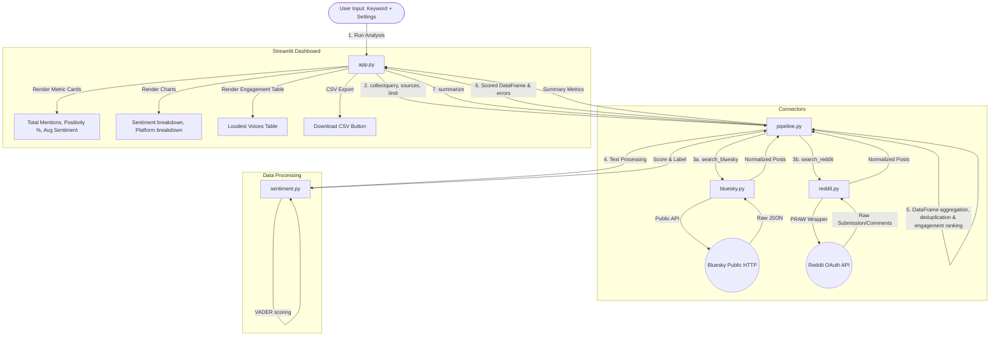

# Public Figure Monitor: Project Overview & Architecture Flow

The **Public Figure Monitor** is a free, self-hosted social listening dashboard. It allows users to track public opinion and sentiment for any keyword (e.g., public figure, brand, topic) across **Bluesky** and **Reddit** using offline sentiment analysis (VADER).

---

## 📂 Project Structure & Component Roles

Here is the current directory layout and the purpose of each file:

*   **[README (22).md](file:///c:/Users/Unmesh/Desktop/socialmedia/README%20(22).md)**: Contains installation, configuration (including Reddit developer application registration), and basic run instructions.
*   **[requirements.txt](file:///c:/Users/Unmesh/Desktop/socialmedia/requirements.txt)**: Specifies project dependencies: `streamlit`, `praw` (Reddit API wrapper), `vaderSentiment` (offline lexicon-based sentiment analyzer), `requests` (for web API queries), and `pandas` (for data manipulation).
*   **[app.py](file:///c:/Users/Unmesh/Desktop/socialmedia/app.py)**: The user interface. Built with Streamlit, it renders a sidebar for queries and parameters, handles search submissions, draws metrics cards/charts, and renders engagement-sorted tables.
*   **[pipeline.py](file:///c:/Users/Unmesh/Desktop/socialmedia/pipeline.py)**: The central orchestration module (the "engine"). It receives search parameters, queries the platform connectors, aggregates the returned posts, computes sentiment, and generates statistics.
*   **[sentiment.py](file:///c:/Users/Unmesh/Desktop/socialmedia/sentiment.py)**: The sentiment analyzer. Uses VADER (`vaderSentiment`) to calculate compound polarity scores (-1.0 to 1.0) and assigns "positive", "negative", or "neutral" labels.
*   **[bluesky.py](file:///c:/Users/Unmesh/Desktop/socialmedia/bluesky.py)**: Connector for Bluesky. Queries Bluesky's public search endpoint (unauthenticated) and returns normalized post dictionaries.
*   **[reddit.py](file:///c:/Users/Unmesh/Desktop/socialmedia/reddit.py)**: Connector for Reddit. Uses PRAW to search posts and top comments (requires read-only credentials stored as environment variables).
*   **[test_engine.py](file:///c:/Users/Unmesh/Desktop/socialmedia/test_engine.py)**: An offline smoke test suite using mock search connectors to verify pipeline functionality without making actual network requests.

---

## 🔄 Core Data & Execution Flow



### Flow Walkthrough
1. **User input**: The user enters a keyword/name in the Streamlit sidebar, selects the platforms to search, sets the post limit, and triggers the run.
2. **Collect**: The UI invokes `collect()` in `pipeline.py`, passing a dictionary mapping platform name to search functions (i.e. `search_bluesky` and `search_reddit`).
3. **Fetching & Normalization**:
   - **Bluesky** connector queries the public JSON API. It maps fields to a normalized dictionary structure:
     ```python
     {
         "platform": "bluesky",
         "id": item_uri,
         "author": handle,
         "author_name": display_name,
         "text": post_text,
         "created_at": created_time,
         "likes": like_count,
         "shares": repost_count,
         "replies": reply_count,
         "url": clickable_post_url
     }
     ```
   - **Reddit** connector initializes `praw.Reddit` using `REDDIT_CLIENT_ID`, `REDDIT_CLIENT_SECRET`, and `REDDIT_USER_AGENT` environment variables. It fetches matching posts and then optionally grabs the top comments (converting comments to matching mock "posts" for sentiment analysis).
4. **Sentiment Scoring**: Every post's text is passed through VADER in `sentiment.py`.
   - VADER computes a compound polarity score in the range `[-1.0, 1.0]`.
   - Sentiment label is classified as:
     - `positive` (compound $\geq 0.05$)
     - `negative` (compound $\leq -0.05$)
     - `neutral` ($-0.05 <$ compound $< 0.05$)
5. **Aggregation & Metrics**:
   - `pipeline.py` deduplicates posts on `["platform", "id"]`.
   - Engagement is calculated as: `likes + shares + replies`.
   - The UI runs `summarize(df)` to calculate:
     - Positivity ratio: \% of opinionated posts (positive + negative) that are positive.
     - Avg sentiment: mean compound score across all posts.
6. **Rendering**: The UI draws metric cards, two bar charts (sentiment and platform breakdown), and lists the top 15 posts sorted by engagement (the "Loudest Voices") in a interactive DataFrame view.

---

## ⚠️ Important Observations & Issues

1. **Connector Imports Path Mismatch**:
   - In `app.py`, the imports are defined as:
     ```python
     from connectors.bluesky import search_bluesky
     from connectors.reddit import search_reddit
     ```
   - However, the `bluesky.py` and `reddit.py` files are located in the **root folder** of the project instead of a `connectors/` folder.
   - **Impact**: Running `streamlit run app.py` will fail with a `ModuleNotFoundError` unless either a `connectors/` subfolder is created containing these files or the imports in `app.py` are modified to `from bluesky import search_bluesky` and `from reddit import search_reddit`.

2. **Environment Variable Requirements**:
   - The Reddit connector will fail at runtime if the required environment variables (`REDDIT_CLIENT_ID`, `REDDIT_CLIENT_SECRET`) are not set, though the pipeline handles platform errors gracefully without crashing the whole application.
